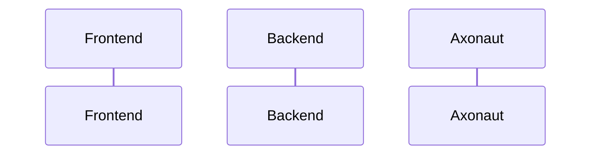

We are thrilled to announce the release of Nuxt UI v3, a complete redesign of our UI library that brings significant improvements in accessibility, performance, and developer experience. This major update represents over 1500 commits of hard work, collaboration, and innovation from our team and the community.

## 🚀 Second title

Lorem ipsum dolor sit amet, consectetur adipiscing elit. Sed do eiusmod tempor incididunt ut labore et dolore magna aliqua.

---

Lorem ipsum dolor sit amet, consectetur adipiscing elit. Sed do eiusmod tempor incididunt ut labore et dolore magna aliqua.

### Third title

Lorem ipsum dolor sit amet, consectetur adipiscing elit. Sed do eiusmod tempor incididunt ut labore et dolore magna aliqua.

#### Fourth title

Lorem ipsum dolor sit amet, consectetur adipiscing elit. Sed do eiusmod tempor incididunt ut labore et dolore magna aliqua.

##### Fifth title

Lorem ipsum dolor sit amet, consectetur adipiscing elit. Sed do eiusmod tempor incididunt ut labore et dolore magna aliqua.

###### Sixth title

```rust
pub struct User {
  // [!code word:firstname:1]
  pub firstname: String,
  pub lastname: String, // [!code highlight]
}

impl User {
  pub fn new() -> Self { // [!code --]
  pub fn new(firstname: String, lastname: String) -> Self { // [!code ++]
    Self { firstname, lastname }
  }
}
```

> [!success]
> Some content is displayed directly!

> [!warning] This is a **collapsible** callout
> Some content shown after opening!

> [!note] This is a **collapsible** callout

> [!error] This is a **collapsible** callout
> Some content shown after opening!

```rust
pub struct User {
    // [!code focus:2]
  pub firstname: String,
  pub lastname: String,
}

impl User {
  pub fn new(firstname: String, lastname: String) -> Self {
    Self { firstname, lastname }
  }
}
```

```rust
pub struct User {
  pub firstname: String // [!code error]
  pub lastname: String, // [!code warning]
}
```

```rust {1,3-4}
pub struct User {
  pub firstname: String,
  pub lastname: String,
}
```

::: code-group labels=[Npm, Rust, Dart]

```bash
npm install rehype-code-group
```

```rust
pub struct Foo {
  pub name: String,
}

impl Foo {
  pub fn new(name: String) -> Self {
    Self { name }
  }
}
```

```dart
final class Foo {
  final String name;
  Foo({required this.name});
}
```

:::



