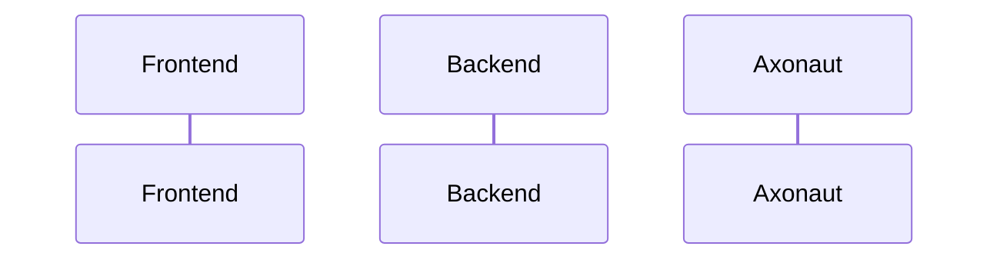

# {frontmatter.title}
```rust
pub struct User {
  pub firstname: String,
  pub lastname: String,
}

impl User {
  pub fn new(firstname: String, lastname: String) -> Self {
    Self { firstname, lastname }
  }
}
```


