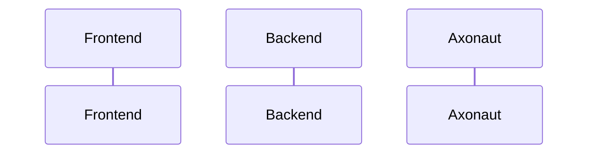

# {frontmatter.title}
```rust
pub struct User {
  // [!code word:firstname:1]
  pub firstname: String,
  pub lastname: String, // [!code highlight]
}

impl User {
  pub fn new() -> Self { // [!code --]
  pub fn new(firstname: String, lastname: String) -> Self { // [!code ++]
    Self { firstname, lastname }
  }
}
```

> [!success]
> Some content is displayed directly!

> [!warning] This is a **collapsible** callout
> Some content shown after opening!

> [!note] This is a **collapsible** callout

> [!error] This is a **collapsible** callout
> Some content shown after opening!

```rust
pub struct User {
    // [!code focus:2]
  pub firstname: String,
  pub lastname: String,
}

impl User {
  pub fn new(firstname: String, lastname: String) -> Self {
    Self { firstname, lastname }
  }
}
```

```rust
pub struct User {
  pub firstname: String // [!code error]
  pub lastname: String, // [!code warning]
}
```

```rust {1,3-4}
pub struct User {
  pub firstname: String,
  pub lastname: String,
}
```

::: code-group labels=[npm, Rust, Dart]

```bash
npm install rehype-code-group
```

```rust
pub struct Foo {
  pub name: String,
}

impl Foo {
  pub fn new(name: String) -> Self {
    Self { name }
  }
}
```

```dart
final class Foo {
  final String name;
  Foo({required this.name});
}
```

:::


